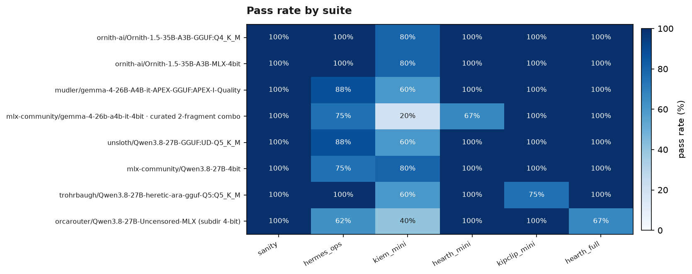

# Summary

**Hand-curated, not auto-regenerated** — unlike `LEADERBOARD.md` (rebuilt
from `log.jsonl` after every run; never hand-edit it), this is a
point-in-time reading of the saved benchmark rows. Last updated
**2026-09-08**. Prior findings, superseded comparisons, and the full
decision history are archived verbatim in [`results/HISTORY.md`](HISTORY.md).

## Current top picks

Top rows of the "Best overall" table in [`LEADERBOARD.md`](LEADERBOARD.md)
(gate: sanity + full hermes_ops + full coding suite, hermes_ops ≥50% pass;
score is a weighted composite — pass rate 45%, speed 25%, runtime 20%,
turns 10%):

| rank | model | engine | reasoning | usefulness gate | score | coding | decode speed | avg TTFT | total runtime (s) | avg turns |
|---|---|---|---|---|---:|---:|---:|---:|---:|---:|
| 1 | ornith-ai/Ornith-1.5-35B-A3B-GGUF:Q4_K_M | llama.cpp | thinking (medium) | PASS (100%, 8) | 0.866 | 93% (15) | 42.4 tok/s | 7.01s | 3504 | 16.8 |
| 2 | mudler/Ornith-1.5-35B-A3B-APEX-GGUF:APEX-I-Quality | llama.cpp | unspecified | PASS (88%, 8) | 0.840 | 93% (15) | 39.5 tok/s | 7.16s | 3355 | 14.2 |
| 3 | Tostibrown/Qwen3.6-35B-A3B-4bit-textonly **←** | mei | thinking | PASS (100%, 8) | 0.832 | 100% (15) | 57.9 tok/s | 43.44s | 5212 | 8.9 |
| 4 | HauhauCS/Qwen3.6-35B-A3B-Uncensored-HauhauCS-Aggressive:Q4_K_M | llama.cpp | thinking | PASS (75%, 8) | 0.815 | 87% (15) | 43.4 tok/s | 7.05s | 2767 | 15.7 |
| 5 | mudler/gemma-4-26B-A4B-it-APEX-GGUF:APEX-I-Quality | llama.cpp | unspecified | PASS (88%, 8) | 0.752 | 87% (15) | 42.9 tok/s | 10.67s | 5398 | 20.2 |
| 6 | mudler/Ornith-1.5-35B-A3B-APEX-GGUF:APEX-Compact | llama.cpp | unspecified | PASS (100%, 8) | 0.729 | 80% (15) | 33.3 tok/s | 10.29s | 4419 | 15.3 |
| 7 | ornith-ai/Ornith-1.5-35B-A3B-MLX-4bit **←** | mei | unspecified | PASS (100%, 8) | 0.729 | 93% (15) | 42.9 tok/s | 43.42s | 4754 | 11.1 |
| 8 | mlx-community/Qwen3.6-35B-A3B-4bit **←** | mei | thinking | PASS (88%, 8) | 0.722 | 87% (15) | 47.6 tok/s | 44.55s | 5712 | 9.5 |

*Composite score = combined hermes_ops+coding pass rate 45% + speed 25% +
time taken 20% + turns used 10%, gate-passers only (hermes_ops ≥ 50%) —
see `LEADERBOARD.md`'s "Best overall" table for the exact per-model numbers
behind this chart. Auto-regenerated by `runner/plot_leaderboard.py` after
every benchmark run.*

## Active optimization targets (2026-09-09)

Model selection is closed. Three Mei configurations are kept, deliberately,
as the ongoing regression targets:

| target | config | why it exists |
|---|---|---|
| **Qwen 3.6 (stock, with vision)** | `configs/Qwen3.6-35B-A3B/mei.yaml` | The benchmark does not exercise vision, but the real Hermes harness will happily take image requests. This is the option that can actually serve them. Latest full run **22/25**. |
| **Qwen 3.6 text-only** | `configs/Qwen3.6-35B-A3B-textonly/mei.yaml` | Vision tower stripped: −0.83 GiB, ~1.3x faster short decode, LLM load path instead of VLM. Latest full run **25/25**, the only clean sweep any Mei config has produced. Text/coding work only. |
| **Ornith 1.5 35B-A3B** | `configs/Ornith-1.5-35B-A3B/mei.yaml` | Latest full run **24/25**, zero harness errors. **Already text-only** — the checkpoint contains no `vision_tower` tensors and no `vision_config`, so there is nothing to strip; its 18.17 GiB matches the stripped Qwen 3.6 exactly. |

Scores are the 2026-09-09 full runs on the RELEASED Mei 0.4.0 build with
prefill step 1024: Qwen 3.6 text-only 25/25, Ornith 24/25, Qwen 3.6 stock
22/25. No model regressed against the 2026-09-07 baselines.

All three sit within one task of each other on quality, so the interesting
differences are on the time axes — and the largest one is not raw speed, it is
a missing feature.

**Mei has no cross-request prompt caching; llama.cpp does.** TTFT per
`hermes_ops` task, in run order, same model family and the same 20k-token
system+tools prefix:

| task | Ornith GGUF / llama.cpp | Ornith MLX / Mei |
|---|---:|---:|
| 1st | 47.2 s | 53.8 s |
| 2nd–8th | 2.3–3.6 s | 53.3–55.2 s |

Cold prefill is comparable (Mei ~14% slower). Everything after that is llama.cpp
reusing a cached prefix and Mei re-prefilling from scratch, every single time.
The averaged `avg TTFT` column understates this for llama.cpp, because seven
cheap requests pull its mean down to ~8 s; read the per-task shape, not the mean.

This was the single largest piece of headroom left, and llama.cpp was the
existence proof that it is reachable without sacrificing multi-turn behaviour.
Mei 0.4.0 shipped an opt-in attempt (`--ssm-anchor-boundaries`) that reached
0.17 s prefill on a restored prefix — better than llama.cpp — but regressed
multi-turn coding wall time and was therefore off by default, with a note here
that the regression looked like an implementation defect rather than an
inherent trade-off.

**The performance half was, and it is fixed** (2026-09-10, Mei branch
`feat/request-log`). The correctness half is not, and the feature stays
default-off because of it — see the end of this section. Mei
passed the fixed anchor list as both the stable-prefix list and the per-turn
history list; vmlx takes the maximum of the latter as the boundary to store
after an answer, so it froze at the anchor and every later turn re-prefilled a
growing tail. Two follow-ups then removed the chat-template renders the feature
was paying for on every turn. Anchors now cost what running without them costs
— 0.47–0.51 s per turn against 0.47–0.52 s — while still restoring the shared
prefix. On `hermes_ops` that takes median TTFT from 53.8 s to 2.4 s and suite
wall from 10.6 to 4.5 minutes, both better than llama.cpp's 2.9–3.3 s and
6.0–9.4 minutes, with exactly one cold prefill in the whole suite.

Two cautions on the coding-suite numbers from that work. A single run measured
14/15 in 25.7 minutes at 11.6 s/turn, against llama.cpp's 14/15 in 44–48
minutes at 11.4–11.8 — but the next run on the same build took 54.6 minutes,
because one request generated 32,768 tokens and ran for 19 minutes. Runaway
generations cost Mei 14.5% of its total coding wall against llama.cpp's 0.7%,
and both engines are now capped at 8,192 output tokens per request so a single
degenerate turn cannot dominate a run. Do not read any single coding wall time
as a stable figure until runs under that cap have accumulated.

**Why it is still off by default.** Restoring the shared prefix written by a
*different* conversation changes what the model generates, at greedy decoding.
Reproduced in two requests: seed the anchor with a throwaway question, then
send a real agent prompt, against a control that sends only the second request
on a fresh cache. The first assistant turn differs. Instrumenting the cache
showed the disk round-trip is faithful — all 162 persisted tensors identical —
so this is not a serialization bug. Prefilling N tokens and then continuing is
simply not equivalent to prefilling N+M in one pass for these recurrent layers,
and a restore is exactly that. Divergence is *worst* at short re-prefilled
tails, which is the shape an agent harness sends, and it propagates: a
conversation that starts from a perturbed anchor writes boundaries carrying the
perturbation, and later conversations inherit it.

So the ~53 s saved on each new conversation is real, and so is the cost. Making
it safe needs segmentation-invariant recurrent prefill, which is upstream
kernel work rather than something the server can arrange. Kiem notes 87a5f6f7,
71fea96e, 4ce197c1 and d2b4a2c9 carry the measurements.

Treat the quality ordering as a tie. The suite samples at temperature 0.6,
and this project's own rule is that single-task swings are noise. Three
things also moved together against the baseline — the 0.4.0 build, the
prefill step, and the harness now counting unreachable-server failures as
harness errors rather than model failures — so attribution between them is
not established. Pick on speed and memory.

Laguna XS 2.1 was evaluated as a fourth candidate and discarded; see below.

Grafting Qwen 3.6's vision tower onto Ornith was considered and rejected:
the shapes line up, but the vision merger was learned jointly against
Qwen 3.6's own text representations, which Ornith's fine-tune has drifted
from — untested, but the prior is bad enough that stock Qwen 3.6 is the
sane route to vision.

Nemotron-3.5-Lightning was discarded 2026-09-07 (see `HISTORY.md`).
Gemma-4 (18/25) and Qwen3.8-Uncensored (20/27) remain on record but are
not optimization targets.

## Tested and discarded

| model | why | record |
|---|---|---|
| **Laguna XS 2.1 MLX** | Its chat template cannot render a history containing an assistant tool_calls message, so every multi-turn task returned an empty response: hermes_ops 2/8, coding skipped by the usefulness gate. Not a capability limit — Ornith handles 19-message tool-call histories on the same build. Fixing it means patching the model provider's own template, which would put our numbers out of reach of anyone else. | Laguna GGUF via llama.cpp remains the model's record at 19/25. |
| **Ternary-Bonsai-27B** | Used only as a dense probe to test whether the unsafe-compile flag helps dense models more than MoE. It does not (+5.3% vs +9%). Never had its agentic coding ability tested. | Not ranked. |
| **NVIDIA-Nemotron-3.5-Lightning** | Does not emit tool calls under a large tool payload; a model capability limit at ~5–6k tokens of realistic tool content, not a parser bug. | 7/25. |

## Headline findings

- **Model selection is closed**; the benchmark is now the regression gate
  for Mei changes.
- **Dense models are a poor fit on this hardware**: Ternary-Bonsai-27B
  (dense, 7.9 GB) reaches ~16 tok/s while Ornith (MoE, 19.5 GB, ~3B active
  per token) reaches ~68, because a dense model streams every weight for
  every token.
- **Prefill, not decode, dominated agent wall time**: an identical
  ~20k-token system+tools prefix was cold-prefilled on every turn at ~61 s.
  See `HISTORY.md`, "The prefix cache is not being used".
- **Cross-conversation prefix reuse** (Mei 0.4.0, opt-in) takes a warm turn
  from ~62 s to ~1.8 s on both Ornith and Qwen 3.6 text-only, with restored
  output byte-identical to cold.
- **Fusing MoE gather calls does not help on this hardware**: two
  independent experiments measured -9.7% and -2.9%.
- **The "Best overall" ranking was fixed on 2026-09-08** to count distinct
  tasks rather than repeated rows; Ornith on Mei had been hidden behind an
  older doubled-trial fragment (commit `758e929`).

## Charts

Regenerated 2026-09-09 from the current `log.jsonl` by
`uv run --locked python runner/build_summary_charts.py` and
`runner/plot_leaderboard.py`. Only charts that regenerate from live data appear
here; see [`HISTORY.md`](HISTORY.md) for ones tied to superseded comparisons.

*Where each model actually fails. `kiem_mini` is the hardest suite across the
whole field; Qwen 3.6 text-only is the only 100% row; Nemotron's collapse
(12% hermes_ops, 0% coding) is visible at a glance. The `sanity` column is
100% for every model and carries no information — it is a gate, not a signal.*

## Where the detail lives

- [`results/HISTORY.md`](HISTORY.md) — every superseded finding, comparison,
  and decision, verbatim.
- [`results/LEADERBOARD.md`](LEADERBOARD.md) — auto-generated, always
  current, never hand-edited.
- [`docs/`](../docs/) — `INFERENCE_ENGINES.md` and `OMLX_MODEL_MATRIX.md`
  for engine-level technical writeups.
