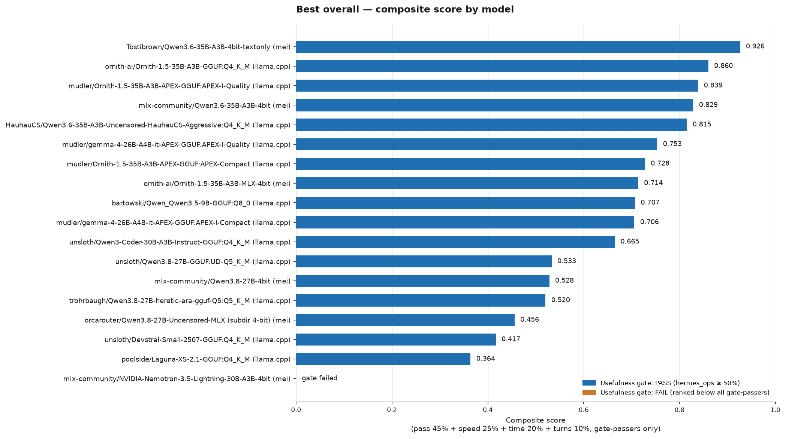

# Current top picks — hand-curated snapshot

**Hand-curated, not auto-regenerated** — unlike `LEADERBOARD.md` (rebuilt
from `log.jsonl` after every run; never hand-edit it), this is a
point-in-time reading of that data. Re-check against `LEADERBOARD.md` if
it's been a while — last updated **2026-08-27**, 1242 log rows / 56
configs.

**The caveat that matters most**: grading was fixed on 2026-08-21 (several
real scoring bugs closed — see `LEADERBOARD.md`'s top warning). Any row
without a `runner_git_sha` predates that fix. All numbers below are from
the 2026-08-26 full-suite rerun (sanity + hermes_ops + all three coding
suites — `kiem_mini`/`hearth_mini`/`kipclip_mini`, 11 coding tasks total),
current grading throughout.

**A known auto-table quirk, not a data problem**: `LEADERBOARD.md`'s "Best
overall" table groups rows by `(config_hash, runner_git_sha)`, and a few
harness-code commits landed *while* a background benchmark run was still
executing (an artifact of this session's autonomous cadence — committing
code fixes between phases of the same live run). That splits one clean,
complete run into two or three `runner_git_sha` fragments, which then fail
the table's own "must have sanity+hermes_ops+coding in one fragment"
eligibility check — so a few of the models below (notably the Qwen3.8-27B
UD-Q5_K_M and Qwen3.6-35B-A3B-Uncensored rows) don't appear cleanly in
that auto-table despite having real, complete data. The numbers below are
reconciled by hand directly from `log.jsonl`'s actual task rows, not from
that table.

*Composite score = pass rate 45% + speed 25% + time taken 20% + turns used*
*10%, gate-passers only (hermes_ops ≥ 50%) — see `LEADERBOARD.md`'s "Best*
*overall" table for the exact per-model numbers behind this chart.*
*Auto-regenerated by `runner/plot_leaderboard.py` after every benchmark*
*run; this image can go stale between SUMMARY.md's own hand-curated edits.*

## The three-way tie on coding pass rate — pick by speed, then hermes_ops

These three all landed **91% coding** (10/11 tasks) on the current full
11-task battery — the highest coding pass rate of anything tested. Speed
and hermes_ops reliability are what separate them:

| Model | Engine | hermes_ops | coding | avg tok/s |
|---|---|---|---|---|
| **Ornith-1.5-35B-A3B** (Q4_K_M) | llama.cpp | **100%** (8/8) | 91% (10/11) | **30.9** |
| Qwen3.6-35B-A3B-Uncensored (Q4_K_M) | llama.cpp | 75% (6/8) | 91% (10/11) | 30.2 |
| Qwen3.8-27B (UD-Q5_K_M, 64K ctx) | llama.cpp | 88% (7/8) | 91% (10/11) | 6.8 |

**Pick: `Ornith-1.5-35B-A3B` on `llama.cpp`.** It's the only one of the
three with a clean hermes_ops sweep (8/8 — no dropped tool-calling/agent-
op task), and it ties the other two on coding while running ~4.5x faster
than the Q5_K_M Qwen3.8-27B variant. `Qwen3.6-35B-A3B-Uncensored` is a
close, genuinely comparable second choice — same coding rate, same speed
tier, just two hermes_ops misses (`error-recovery`, `persistent-failure`)
Ornith didn't have.

Config: `configs/Ornith-1.5-35B-A3B/gguf.yaml`. First attempt at testing
this hit a false "backend never became healthy" report (~17.5min cold-
cache load exceeding the harness's old 600s health-check timeout) —
confirmed healthy via the server log and a live curl, recovered with a
plain relaunch. This exact incident is why the timeout was raised to 1800s
(see "Harness fixes" below) — worth knowing if you re-run this config and
the first load looks slow.

## Next tier — 82% coding, still solid, slower or less reliable

| Model | Engine | hermes_ops | coding | avg tok/s |
|---|---|---|---|---|
| Muse-Glimmer-30B (Q4_K_M) | llama.cpp | 62% (5/8) | 82% (9/11) | 8.5 |
| Qwen3.8-27B-Uncensored (Q4_K_M) | llama.cpp | 75% (6/8) | 82% (9/11) | 8.1 |
| Qwen3.8-27B-Uncensored (Q5_K_M) | llama.cpp | 62.5% (5/8) | 82% (9/11) | 6.7 |

Both Q4_K_M entries genuinely capable, held back mostly by speed (~8 tok/s)
rather than correctness — every fail on record for these two is a real,
on-topic wrong answer or a genuine timeout, not a harness artifact.

**The Q5_K_M row above is a deliberate negative-result test** (2026-08-27,
user-approved follow-up to the Kiem "Qwen3.8 + llama.cpp speed and
agentic-efficiency investigation" plan): the base Qwen3.8-27B jumped from
73-82% coding at Q4_K_M to 91% at UD-Q5_K_M (see the three-way tie above),
so this tested whether bumping the Uncensored fine-tune to its own
Q5_K_M quant (available in the same HF repo, untested until now)
reproduced that jump. **It didn't.** Coding pass rate is identical to the
Q4_K_M version (82%, not improved), while hermes_ops reliability is
notably worse (62.5% vs 75%) and speed is slower (6.7 vs 8.1 tok/s) — all
from genuine task timeouts on a model that simply runs slower at Q5, not
harness artifacts. **The lesson: "bump the quant for better quality" is
checkpoint-specific, not a universal rule for this model family** — it
worked for the base model, it did not meaningfully help this particular
fine-tune. Neither the extra quality nor the extra memory cost is
justified here; stick with the Q4_K_M Uncensored config or the base
model's own Q5_K_M config, not this combination. Config:
`configs/Qwen3.8-27B-Uncensored/gguf-q5.yaml`.

## Mid tier — 64-73% coding

| Model | Engine | hermes_ops | coding | avg tok/s |
|---|---|---|---|---|
| Qwen3-Coder-30B-A3B (Q4_K_M) | llama.cpp | 75% (6/8) | 73% (8/11) | 20.8 |
| Devstral-Small-2507 (Q4_K_M) | llama.cpp | 75% (6/8) | 73% (8/11) | 7.7 |
| Qwen3.5-9B (Q8_0) | llama.cpp | 75% (6/8) | 64% (7/11) | 20.9 |

Qwen3-Coder-30B-A3B is the best speed/capability balance in this tier —
worth considering if the top-tier models' memory footprint is a concern
(it's the smallest of the strong performers). Devstral needed a hermes
provider registration fix mid-session (see "Issues found and fixed"
below) before its coding suite would run at all — now resolved and
re-tested clean.

## Fast, but doesn't do agentic coding — a real, repeated finding

Every `LiquidAI/LFM2.5-8B-A1B` variant tested (GGUF Q8_0, GGUF BF16, MLX,
vllm-mlx, and two DSpark/speculative-decoding attempts) scored **0/11 or
1/11 on the coding suite** despite being the fastest models in the whole
benchmark (55-68 tok/s). This isn't an infra artifact — confirmed via
`hermes_turns`/`hermes_tool_calls` being populated (real, if weak, model
output) on every attempt, not the null/missing pattern that flags a
harness crash. The smaller `LiquidAI/LFM2.5-2.6B` (Q8_0) does somewhat
better (36%, 4/11) at a still-fast 62.6 tok/s, but nowhere near the coding
capability of the models above. **Speed alone doesn't make a model a
viable Hermes backend on this benchmark.**

## Unresolved: Laguna-XS-2.1

Still no usable data. The GGUF server loads and responds to real
completions (confirmed via direct curl, 32 tokens generated), but this
harness's plain-completion probe doesn't recognize the model's output
shape — diagnosed as reasoning-only output the probe isn't written to
parse. `sanity_only` viable in its config; not re-attempted this round
since the gap is in the probe itself, not something a rerun would fix.

## Hosted-model reference set (2026-08-26)

Two hosted models, run through the exact same full suite (sanity +
hermes_ops + all 11 coding tasks) via real, metered OpenRouter API keys —
included as a cost/quality reference point, **not** as a candidate to pick
instead of a local model. The whole point of this benchmark is finding the
best *local* Hermes backend; these two exist so a reader can see what
paying for a hosted model actually buys, in the same units as everything
above.

| Model | hermes_ops | coding | avg tok/s¹ | real cost (sanity+hermes_ops) |
|---|---|---|---|---|
| `openai/gpt-5.6-luna` (OpenRouter) | 100% (8/8) | 91% (10/11) | 20.5 | $0.0235 |
| `anthropic/claude-haiku-4.5` (OpenRouter) | 100% (8/8) | 82% (9/11) | 36.3 | $0.82 |

¹ Hosted-model tok/s is a network-latency-inclusive API measurement, not a
pure decode rate the way local `avg tok/s` is elsewhere in this doc — not
strictly apples-to-apples with the local models' numbers, but still a
useful relative signal.

**Luna genuinely ties the best local models** (91% coding, matching the
three-way tie above) with a clean 100% hermes_ops sweep, at a real cost of
about 2 cents for the sanity+hermes_ops portion of a full run — this is
the old FAIL-under-old-single-task-grading result flipping to a strong
PASS once retested under the current full 11-task battery. **Haiku** lands
respectably at 82% (matching the "next tier" local models) but costs
roughly 35x more than Luna for the same sanity+hermes_ops slice ($0.82 vs
$0.0235) — consistent with its higher per-token OpenRouter pricing ($1/$5
vs Luna's $0.20/$1.20 per 1M input/output tokens). Neither hosted model's
coding-suite cost is tracked (hermes chat's CLI has no simple per-run
usage export — see each config's own `known_gaps`), so the real full-run
cost is higher than the sanity+hermes_ops figure shown, by an unknown
amount.

Configs: `configs/Luna/openrouter.yaml`, `configs/Haiku/openrouter.yaml`.
Both need `OPENROUTER_API_KEY` set as an environment variable — never
committed to this repo.

## Decision (2026-08-25): MLX-backend investigation closed

**Plain llama.cpp/GGUF wins essentially every real speed comparison run
so far** — often several times faster than the same model on vllm-mlx or
oMLX, including at matched quantization (ruling out "it's just a
lower-precision quant" as the explanation). The isolated oMLX backend
additionally hung repeatedly (2+ hours, once 11+) in a non-convergent
tool-calling loop across multiple models. The gap was judged too large and
too consistent to close with config tuning, so further MLX investigation
is closed — GGUF/llama.cpp is the primary engine going forward. If you're
choosing a serving engine independent of model, start there; existing
MLX-backend rows below stay as historical record, not open questions.

## Decision (2026-08-25): retired near-duplicate configs

After the harness improvement plan landed (layered timeout/liveness
budgets, semantic error-recovery grading — see `AGENTS.md`), the surviving
GGUF candidate list was reviewed for near-duplicates: model families with
multiple fine-tune/quant variants where one variant already clearly
dominates (or ties) another. Retired configs are NOT marked
`viable: blocked` — they still work, they're just not being actively
retested going forward. Each carries its own inline retirement note; this
is the consolidated rationale.

**Qwen3.8-27B family** — `Qwen3.8-27B-Uncensored/gguf.yaml` and
`gguf-unsloth-ud-q5-64k.yaml` (see the three-way tie above) are the
active representatives of this family. Retired:
- `Qwen3.8-27B/gguf.yaml` (base) — 82% coding, beaten by the Uncensored
  variant on coding pass rate with comparable speed.
- `Qwen3.8-27B-Ridge/gguf.yaml` — ties on coding but slower.
- `Qwen3.8-27B/gguf-mtp-speed.yaml` — confirmed NEGATIVE result on its
  own terms (the MTP+quantized-KV speed tactic doesn't help on this Mac).
- `Qwen3.8-27B/gguf-unsloth-ud-q2.yaml`, `gguf-unsloth-ud-q4.yaml`,
  `gguf-dflash2.yaml` — all `sanity_and_hermes_ops_only` (ctx-size
  structurally below hermes's 64K coding minimum), never real coding
  candidates regardless of this decision.

**Qwen3.6-35B-A3B family** — checked the real numbers and this one is a
**near-tie**, not a clear win: base and `Qwen3.6-35B-A3B-Uncensored/gguf.yaml`
both landed 91% coding this round (base: 10/11 per the earlier retirement
note's 2026-08-25 check), both similar hermes_ops/speed. Retired the base
config anyway per standing preference for the uncensored variant when
tied-or-better — flagging explicitly that this is preference-driven, not
evidence-driven, unlike the 27B family above.

**LiquidAI-LFM2.5-8B-A1B family** — `gguf-dspark.yaml` (DSpark speculative
decoding) measured slower (26.9 tok/s) than the plain `gguf.yaml` it
modifies (66.4 tok/s) — the same negative-speed-tactic pattern as the
Qwen3.8-27B MTP finding above. The whole 8B-A1B family also scores 0/11 on
coding regardless of engine or speed tactic (see "Fast, but doesn't do
agentic coding" above) — the speed-tactic question is somewhat moot given
that underlying finding.

## Harness fixes shipped this session (2026-08-26)

- **"Best overall" ranking redesigned to gate-then-rank** (replacing a
  weighted blend): a group must have completed all three stages (sanity +
  hermes_ops + coding) to appear at all; hermes_ops pass rate ≥50% is a
  hard pass/fail usefulness gate, not a weighted input; coding pass rate
  is the primary sort among gate-passers; avg tok/s is only a tie-break.
  See `runner/build_leaderboard.py` and its own comments for the full
  reasoning.
- **Backend health-check timeout raised from 600s to 1800s**
  (`bench_common.BACKEND_HEALTH_TIMEOUT_SECONDS`): a large GGUF's
  cold-cache first load can genuinely take 15-20+ minutes on this
  hardware — confirmed twice this session (`LiquidAI/LFM2.5-8B-A1B-GGUF:BF16`
  and `Ornith-1.5-35B-A3B`) as false "backend never became healthy"
  reports on servers that were actually loading fine.

## What to do next, if picking today

Use `Ornith-1.5-35B-A3B` on `llama.cpp` (Q4_K_M) —
`configs/Ornith-1.5-35B-A3B/gguf.yaml`. It's the only model in the whole
dataset combining a clean 100% hermes_ops sweep with the best coding pass
rate observed (91%) at real, usable speed (30.9 tok/s). If you want a
close second with a different risk profile, `Qwen3.6-35B-A3B-Uncensored`
matches its coding rate and speed but has two hermes_ops misses Ornith
didn't have. For context: the hosted `openai/gpt-5.6-luna` (via
OpenRouter) ties this exact coding pass rate for about 2 cents per full
sanity+hermes_ops run — worth knowing as a ceiling reference, but Ornith
gets the same result locally, for free, at comparable speed.
