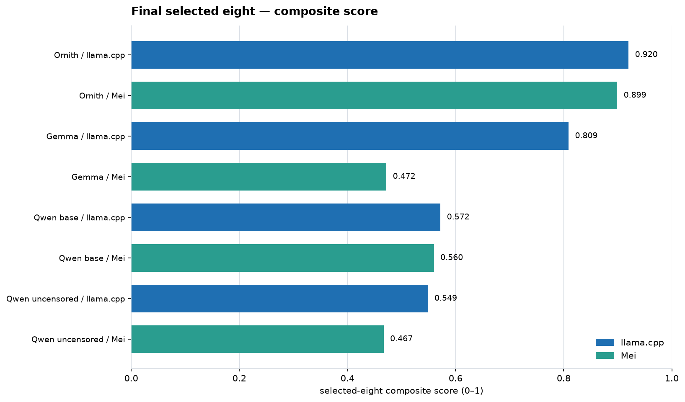
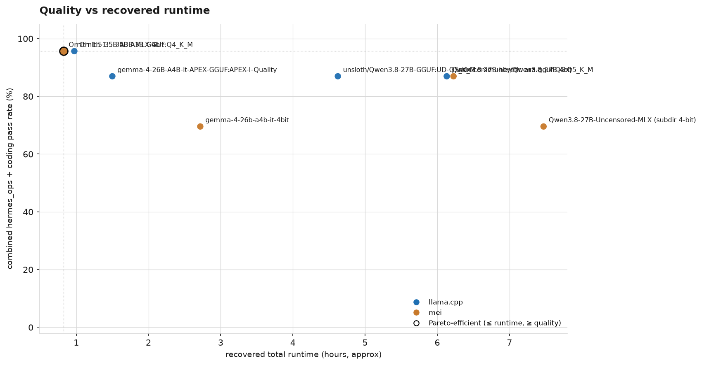
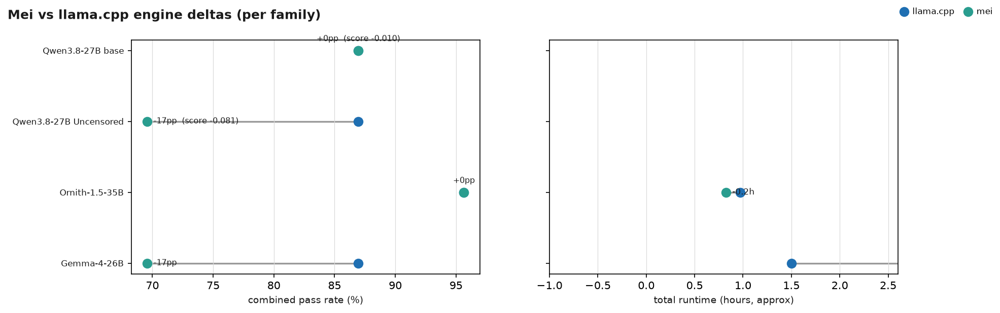
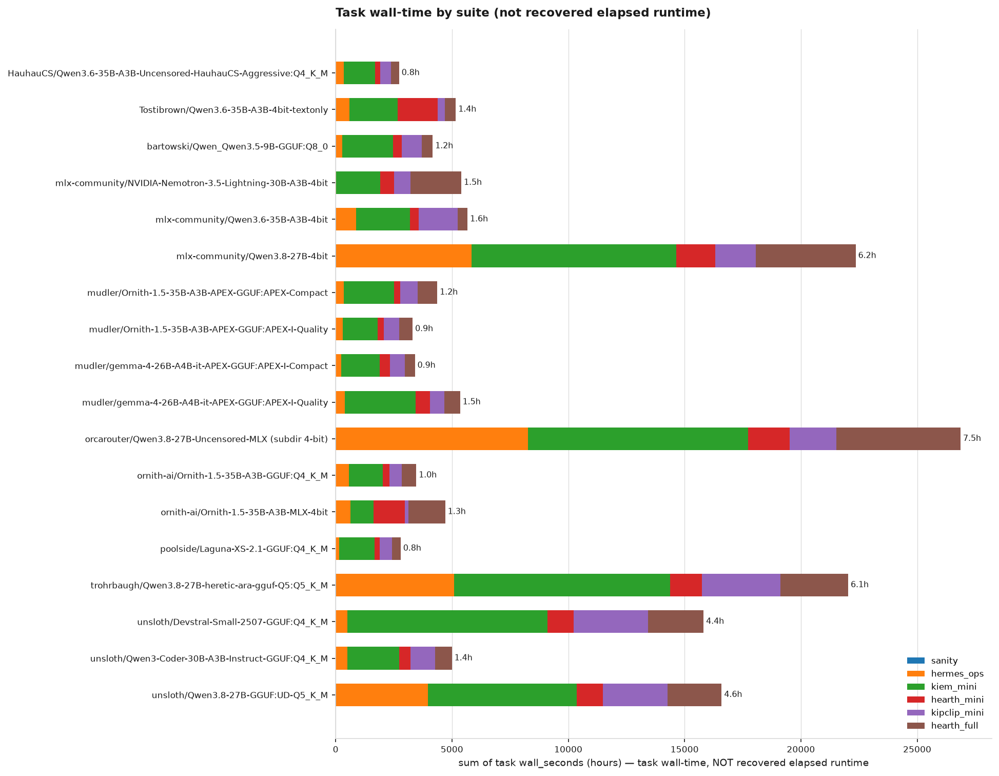
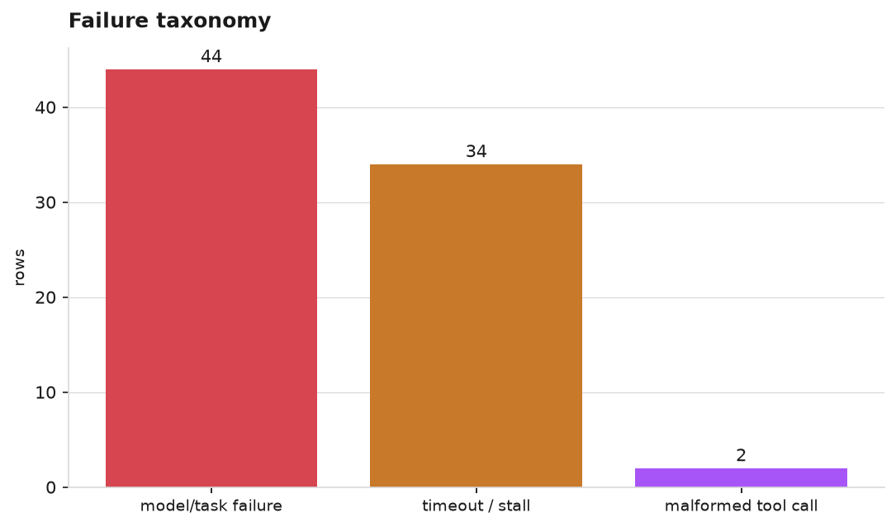

# Summary

**Hand-curated, not auto-regenerated** — unlike `LEADERBOARD.md` (rebuilt
from `log.jsonl` after every run; never hand-edit it), this is a
point-in-time reading of the saved benchmark rows. Last updated
**2026-09-08**. Prior findings, superseded comparisons, and the full
decision history are archived verbatim in [`results/HISTORY.md`](HISTORY.md).

## Current top picks

Top rows of the "Best overall" table in [`LEADERBOARD.md`](LEADERBOARD.md)
(gate: sanity + full hermes_ops + full coding suite, hermes_ops ≥50% pass;
score is a weighted composite — pass rate 45%, speed 25%, runtime 20%,
turns 10%):

| rank | model | engine | reasoning | usefulness gate | score | coding | speed | total runtime (s) | avg turns |
|---|---|---|---|---|---:|---:|---:|---:|---:|
| 1 | ornith-ai/Ornith-1.5-35B-A3B-GGUF:Q4_K_M | llama.cpp | thinking (medium) | PASS (100%, 8) | 0.850 | 93% (15) | 30.0 tok/s | 3504 | 16.8 |
| 2 | Tostibrown/Qwen3.6-35B-A3B-4bit-textonly | mei | thinking | PASS (100%, 8) | 0.842 | 87% (15) | 18.3 tok/s | 2772 | 7.8 |
| 3 | mudler/Ornith-1.5-35B-A3B-APEX-GGUF:APEX-I-Quality | llama.cpp | unspecified | PASS (88%, 8) | 0.838 | 93% (15) | 28.9 tok/s | 3355 | 14.2 |
| 4 | HauhauCS/Qwen3.6-35B-A3B-Uncensored-HauhauCS-Aggressive:Q4_K_M | llama.cpp | thinking | PASS (75%, 8) | 0.838 | 87% (15) | 30.1 tok/s | 2767 | 15.7 |
| 5 | poolside/Laguna-XS-2.1-GGUF:Q4_K_M | llama.cpp | thinking | PASS (50%, 8) | 0.808 | 87% (15) | 34.8 tok/s | 2840 | 25.3 |
| 6 | ornith-ai/Ornith-1.5-35B-A3B-MLX-4bit | mei | unspecified | PASS (100%, 8) | 0.767 | 93% (15) | 16.3 tok/s | 4317 | 8.5 |

*Composite score = combined hermes_ops+coding pass rate 45% + speed 25% +
time taken 20% + turns used 10%, gate-passers only (hermes_ops ≥ 50%) —
see `LEADERBOARD.md`'s "Best overall" table for the exact per-model numbers
behind this chart. Auto-regenerated by `runner/plot_leaderboard.py` after
every benchmark run.*

## Active optimization targets (2026-09-07)

Model selection is closed. Three Mei configurations are kept, deliberately,
as the ongoing regression targets:

| target | config | why it exists |
|---|---|---|
| **Qwen 3.6 (stock, with vision)** | `configs/Qwen3.6-35B-A3B/mei.yaml` | The benchmark does not exercise vision, but the real Hermes harness will happily take image requests. This is the option that can actually serve them. Latest full run 21/25. |
| **Qwen 3.6 text-only** | `configs/Qwen3.6-35B-A3B-textonly/mei.yaml` | Vision tower stripped: −0.83 GiB, ~1.3x faster short decode, LLM load path instead of VLM. Latest full run 23/25. Text/coding work only. |
| **Ornith 1.5 35B-A3B** | `configs/Ornith-1.5-35B-A3B/mei.yaml` | Best of the three on the latest full run at 24/25. **Already text-only** — the checkpoint contains no `vision_tower` tensors and no `vision_config`, so there is nothing to strip; its 18.17 GiB matches the stripped Qwen 3.6 exactly. |

Scores above are the 2026-09-07 full runs on the current configuration
(25 graded rows each, zero harness errors): Ornith 24/25, Qwen 3.6
text-only 23/25, Qwen 3.6 stock 21/25. All three moved by 1-2 tasks
against the previous build, which is inside the single-trial variance the
text-only work measured, so treat them as tied on quality and pick on
speed and memory.

Grafting Qwen 3.6's vision tower onto Ornith was considered and rejected:
the shapes line up, but the vision merger was learned jointly against
Qwen 3.6's own text representations, which Ornith's fine-tune has drifted
from — untested, but the prior is bad enough that stock Qwen 3.6 is the
sane route to vision.

Nemotron-3.5-Lightning was discarded 2026-09-07 (see `HISTORY.md`).
Gemma-4 (18/25) and Qwen3.8-Uncensored (20/27) remain on record but are
not optimization targets.

## Headline findings

- **Model selection is closed**; the benchmark is now the regression gate
  for Mei changes.
- **Dense models are a poor fit on this hardware**: Ternary-Bonsai-27B
  (dense, 7.9 GB) reaches ~16 tok/s while Ornith (MoE, 19.5 GB, ~3B active
  per token) reaches ~68, because a dense model streams every weight for
  every token.
- **Prefill, not decode, dominated agent wall time**: an identical
  ~20k-token system+tools prefix was cold-prefilled on every turn at ~61 s.
  See `HISTORY.md`, "The prefix cache is not being used".
- **Cross-conversation prefix reuse** (Mei 0.4.0, opt-in) takes a warm turn
  from ~62 s to ~1.8 s on both Ornith and Qwen 3.6 text-only, with restored
  output byte-identical to cold.
- **Fusing MoE gather calls does not help on this hardware**: two
  independent experiments measured -9.7% and -2.9%.
- **The "Best overall" ranking was fixed on 2026-09-08** to count distinct
  tasks rather than repeated rows; Ornith on Mei had been hidden behind an
  older doubled-trial fragment (commit `758e929`).

## Charts

The following are from the 2026-09-06 "Final eight" post-fix comparison
(archived in full in `HISTORY.md`):

## Where the detail lives

- [`results/HISTORY.md`](HISTORY.md) — every superseded finding, comparison,
  and decision, verbatim.
- [`results/LEADERBOARD.md`](LEADERBOARD.md) — auto-generated, always
  current, never hand-edited.
- [`docs/`](../docs/) — `INFERENCE_ENGINES.md` and `OMLX_MODEL_MATRIX.md`
  for engine-level technical writeups.
